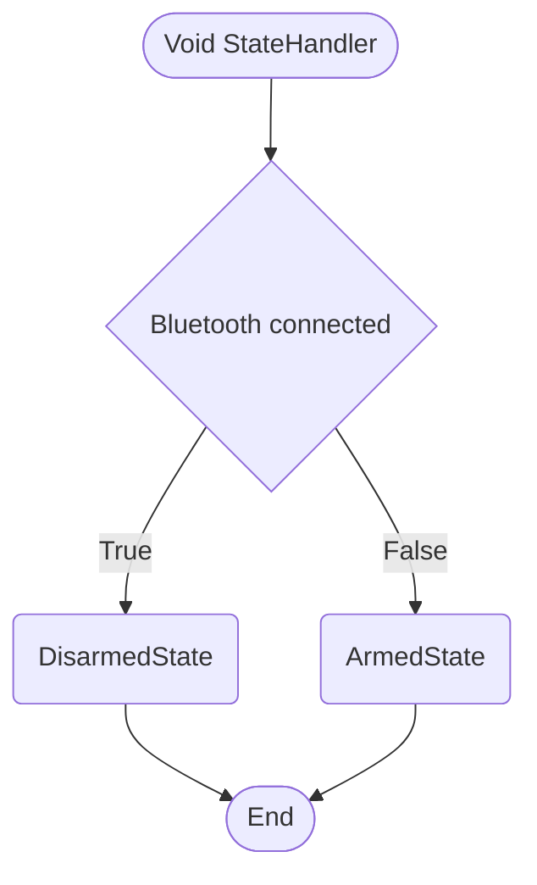
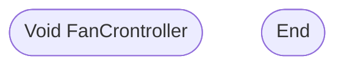
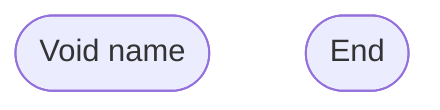

# Table of contents
- [Void setup](https://github.com/TheDjgamerProductions/Robotics2022/blob/main/Assessments/Assessment_2_Smart_Device_House/Logic.md#void-setup)
- [Void Loop](https://github.com/TheDjgamerProductions/Robotics2022/blob/main/Assessments/Assessment_2_Smart_Device_House/Logic.md#void-loop)
- [Void StateHandler](https://github.com/TheDjgamerProductions/Robotics2022/blob/main/Assessments/Assessment_2_Smart_Device_House/Logic.md#void-statehandler)
- [Void LEDController](https://github.com/TheDjgamerProductions/Robotics2022/blob/main/Assessments/Assessment_2_Smart_Device_House/Logic.md#void-ledcontroller)
- [Void FanCrontroller](https://github.com/TheDjgamerProductions/Robotics2022/blob/main/Assessments/Assessment_2_Smart_Device_House/Logic.md#void-fancrontroller)

## Void setup

- - - -

# Void loop

- - - -

# Void StateHandler

- - - -

# Void LEDController

- -  -

# Void FanCrontroller

<!--- template

-->
