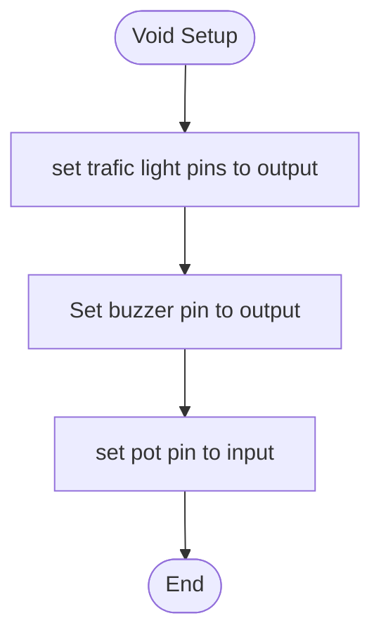
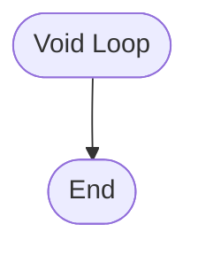

```mermaid
  flowchart TD
    terminalStart([Void Setup])
    step1[set trafic light pins to output]
    step2[Set buzzer pin to output]
    step3[set pot pin to input]
    terminalEnd([End])
    terminalStart --> step1 --> step2 --> step3 --> terminalEnd
```

```mermaid
  flowchart TD
    terminalStart([Void Loop])
    terminalEnd([End])
    terminalStart --> terminalEnd
```

<!--- template
```mermaid
  flowchart TD
    terminalStart([Void name])
    terminalEnd([End])
    terminalStart -> terminalEnd
```
-->
