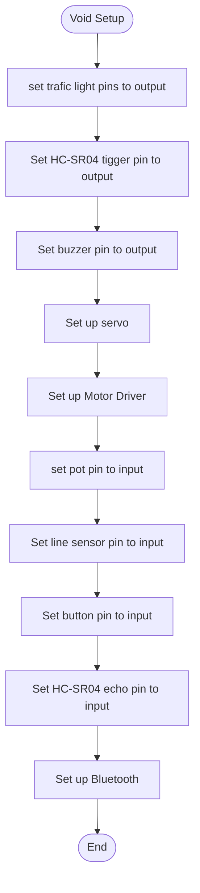
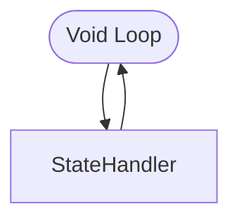
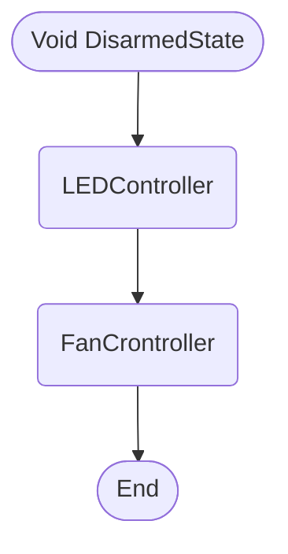
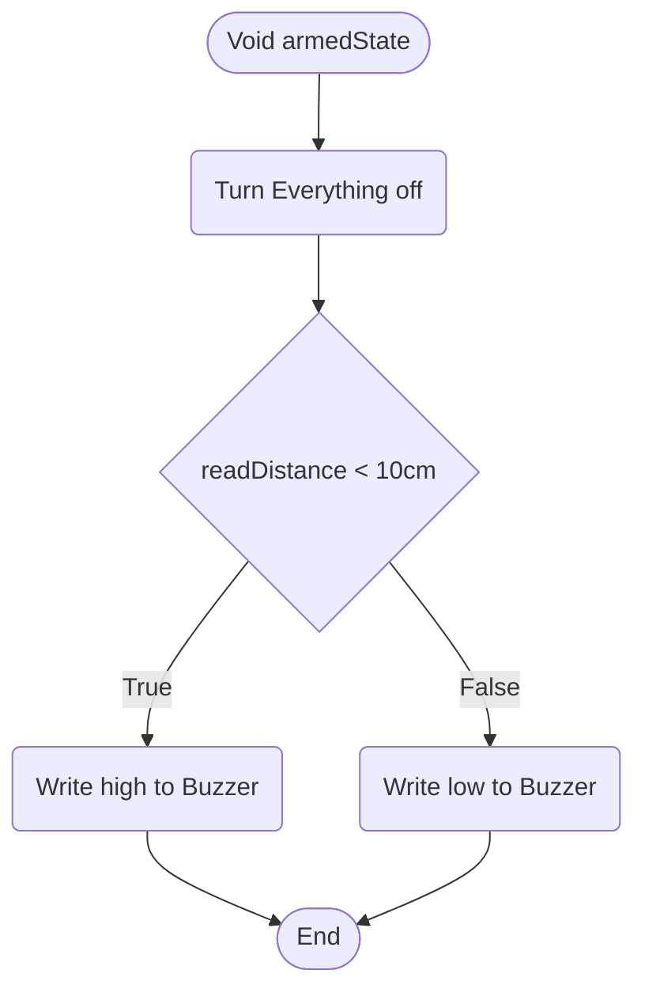
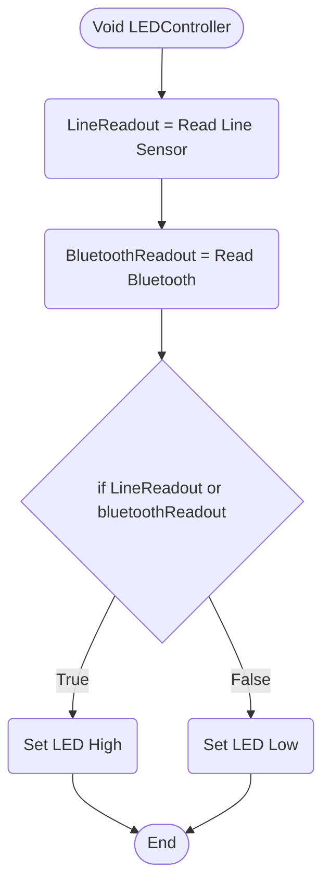
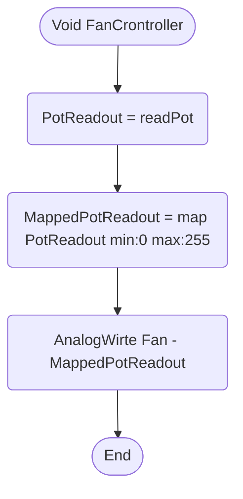
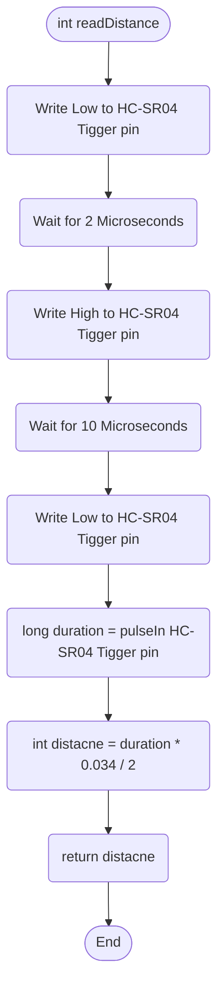

# Table of contents
- [Void setup](https://github.com/TheDjgamerProductions/Robotics2022/blob/main/Assessments/Assessment_2_Smart_Device_House/Logic.md#void-setup)
- [Void Loop](https://github.com/TheDjgamerProductions/Robotics2022/blob/main/Assessments/Assessment_2_Smart_Device_House/Logic.md#void-loop)
- [Void StateHandler](https://github.com/TheDjgamerProductions/Robotics2022/blob/main/Assessments/Assessment_2_Smart_Device_House/Logic.md#void-statehandler)
- [Void DisarmedState](https://github.com/TheDjgamerProductions/Robotics2022/blob/main/Assessments/Assessment_2_Smart_Device_House/Logic.md#Void-DisarmedState)
- [Void armedState](https://github.com/TheDjgamerProductions/Robotics2022/blob/main/Assessments/Assessment_2_Smart_Device_House/Logic.md#Void-armedState)
- [Void LEDController](https://github.com/TheDjgamerProductions/Robotics2022/blob/main/Assessments/Assessment_2_Smart_Device_House/Logic.md#void-ledcontroller)
- [Void FanCrontroller](https://github.com/TheDjgamerProductions/Robotics2022/blob/main/Assessments/Assessment_2_Smart_Device_House/Logic.md#void-fancrontroller)
- [Int readDistance](https://github.com/TheDjgamerProductions/Robotics2022/blob/main/Assessments/Assessment_2_Smart_Device_House/Logic.md#int-readDistance)

- - -

# Void setup

- - - -

# Void loop

- - - -

# Void StateHandler
This function is used to determan what state the system should be in (Armed or Disarmed)

- - - -
# Void DisarmedState
This function is used to call the other functions that are used to implement user control when the system is in a disarmed state

- - - 
# Void armedState
This function is used when the system is armed due to the user not being conected.

When someone is within distance to the sonar it sounds the alarm.

See readDistacne function [Here](https://github.com/TheDjgamerProductions/Robotics2022/blob/main/Assessments/Assessment_2_Smart_Device_House/Logic.md#int-readDistance)

- - - 

# Void LEDController
This function is used to controll the LEDs when the system is in a disarmed state

- -  -

# Void FanCrontroller
*Description goes here*

- - -

# Int readDistance

<!--- template

-->
