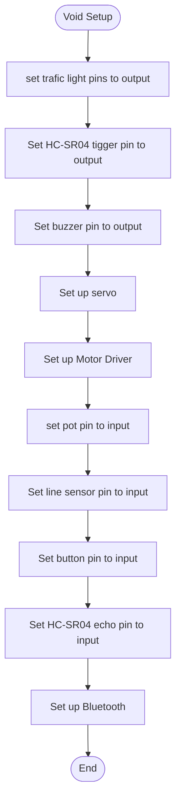
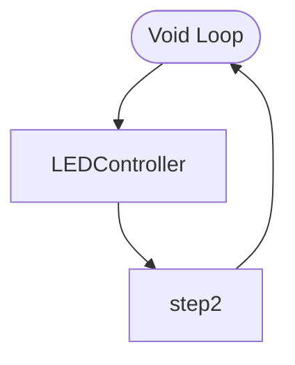
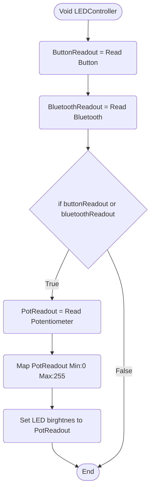
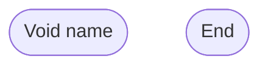

```mermaid
  flowchart TD
    terminalStart([Void Setup])
    step1[set trafic light pins to output]
    step2[Set HC-SR04 tigger pin to output]
    step3[Set buzzer pin to output]
    step4[Set up servo]
    step5[Set up Motor Driver]
    step6[set pot pin to input]
    step7[Set line sensor pin to input]
    step8[Set button pin to input]
    step9[Set HC-SR04 echo pin to input]
    step10[Set up Bluetooth]
    terminalEnd([End])
    terminalStart --> step1 --> step2 --> step3 --> step4 --> step5 --> step6 --> step7 --> step8 --> step9 --> step10 --> terminalEnd
```

- - - -

```mermaid
  flowchart TD
    terminalStart([Void Loop])
    step1[LEDController]
    step2[step2]
    terminalStart --> step1 --> step2 --> terminalStart
```

- - - -

```mermaid
  flowchart TD
    terminalStart([Void LEDController])
    terminalEnd([End])
    readPot(PotReadout = Read Potentiometer)
    mapReadout(Map PotReadout Min:0 Max:255)
    buttonReadout(ButtonReadout = Read Button)
    bluetoothReadout(BluetoothReadout = Read Bluetooth)
    setLED(Set LED birghtnes to PotReadout)
    ifButtonandBluetooth{if buttonReadout or bluetoothReadout}
    terminalStart --> buttonReadout --> bluetoothReadout --> ifButtonandBluetooth
    ifButtonandBluetooth --> |True| readPot --> mapReadout --> setLED --> terminalEnd
    ifButtonandBluetooth --> |False| terminalEnd 
```

<!--- template

```mermaid
  flowchart TD
    terminalStart([Void name])
    terminalEnd([End])
```
-->
